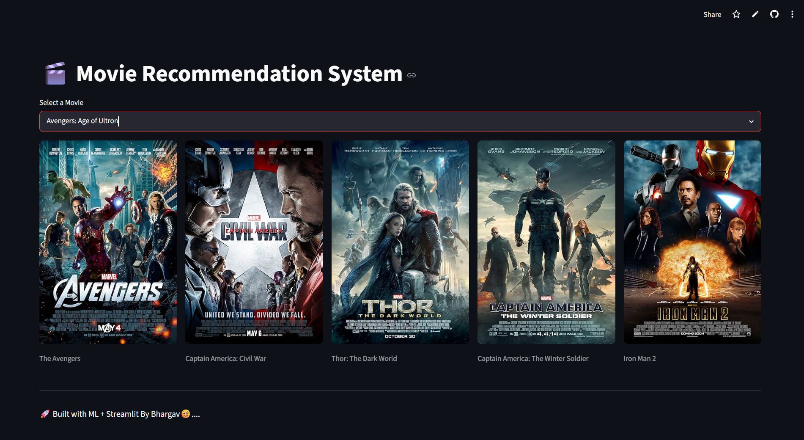

# 🎬 Movie Recommendation System

A Machine Learning-powered Movie Recommendation System that recommends similar movies based on content similarity. The application uses TF-IDF Vectorization and Cosine Similarity to provide personalized movie recommendations and fetches movie posters in real-time using the OMDb API.

## 🚀 Live Demo

🔗 https://movie-recommendation-system-5rfplu5vsb7evxasayclsh.streamlit.app/

---

## 📌 Project Overview

This project is a Content-Based Movie Recommendation System developed using Machine Learning techniques. Users can select a movie and receive recommendations for similar movies based on metadata analysis and similarity matching.

The application is deployed on Streamlit Cloud and provides an interactive user experience with real-time movie posters.

---

## ✨ Features

* 🎥 Content-Based Movie Recommendations
* 🤖 Machine Learning Recommendation Engine
* 🔍 Easy Movie Selection Interface
* 🖼 Real-Time Movie Posters using OMDb API
* ⚡ Fast Similarity Search using TF-IDF & Cosine Similarity
* ☁️ Cloud Deployment with Streamlit

---

## 🛠 Tech Stack

### Programming Language

* Python

### Machine Learning

* TF-IDF Vectorization
* Cosine Similarity

### Libraries & Frameworks

* Streamlit
* Pandas
* NumPy
* Scikit-Learn
* Requests

### Deployment

* Streamlit Cloud
* GitHub

---

## 📂 Project Structure

```text
Movie-Recommendation-System/
│
├── app.py
├── movies.pkl
├── requirements.txt
├── README.md
└── .gitignore
```

---

## ⚙️ How It Works

1. User selects a movie from the dropdown menu.
2. TF-IDF converts movie metadata into numerical vectors.
3. Cosine Similarity identifies movies with similar content.
4. Top recommended movies are displayed.
5. Movie posters are fetched dynamically using the OMDb API.

---

## 🎯 Learning Outcomes

Through this project, I gained practical experience in:

* Machine Learning Fundamentals
* Recommendation Systems
* Feature Extraction using TF-IDF
* Similarity-Based Search
* API Integration
* Git & GitHub Workflow
* Streamlit Application Development
* Cloud Deployment

---

## 📸 Application Preview


---

## 👨‍💻 Author

**Bhargav Sai**

GitHub: https://github.com/bhargavasaiii17-svg

LinkedIn: https://www.linkedin.com/in/bhargava-sai-3a2b43349?utm_source=share_via&utm_content=profile&utm_medium=member_android

---

## ⭐ Support

If you found this project useful, consider giving it a star on GitHub.

